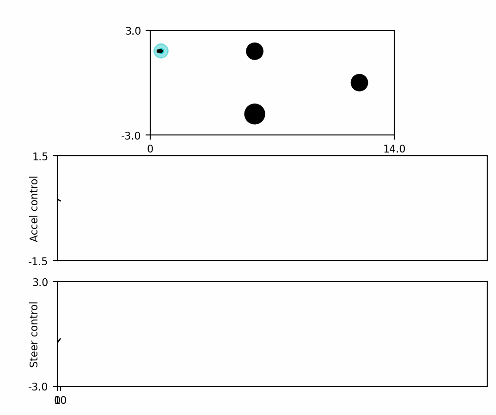
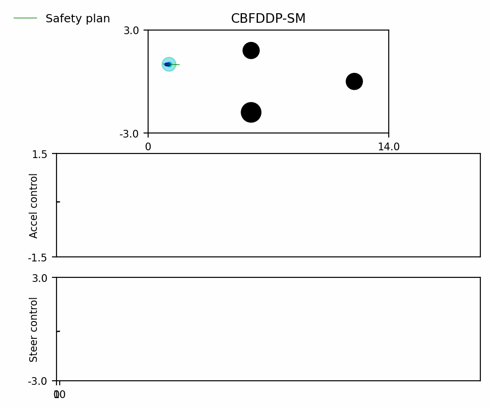
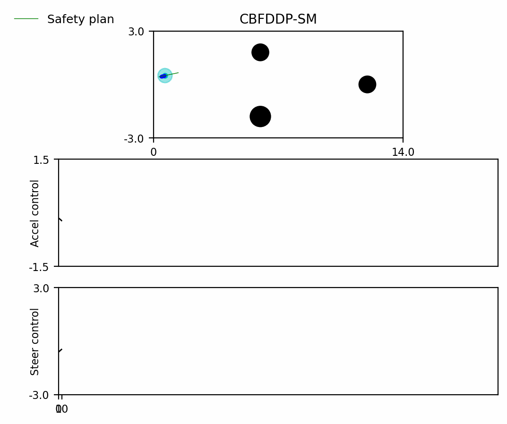
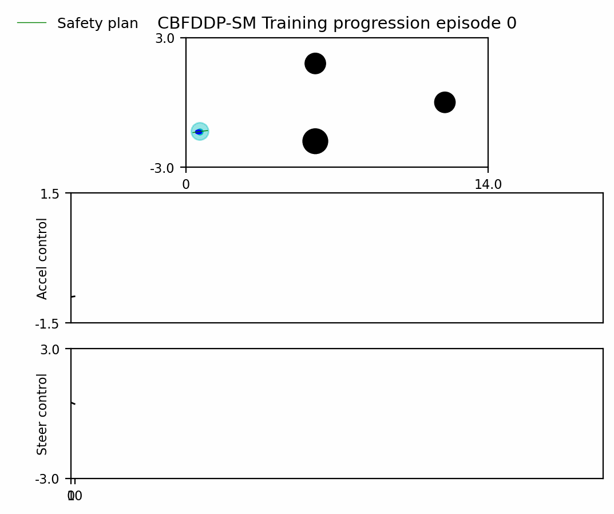
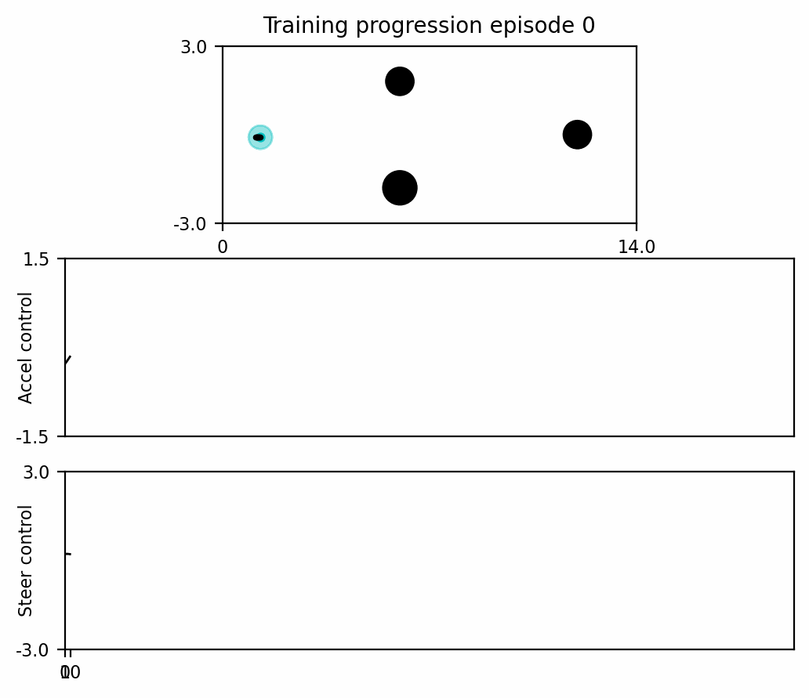

# CBF-DDP V2 within a training loop
This is an extension for using https://github.com/athindran/CBFDDP_Soft_v2 within a Soft Actor-Critic training loop. The code is not clean enough to be made public.

# Usage Instructions

We run three different types of training:

1) Training with no CBFDDP
2) Training with CBF DDP with no penalty for using the filter
3) Training CBF DDP with a penalty for using the filter in the reward

The reward description is inside `simulators/base_single_env.py`. This will therefore work only in the scripts provided below. The rest of the code is largely unused.

The training scripts are as follows:
```
# Training with no CBFDDP
python train_sac_withcbfddp.py -cf ./test_configs/reachability/test_config_cbf_reachability_circle_config_multiple_obs_2_bic5D_train.yaml -rb 3.0 -ls 'baseline' --seed 123 --hidden_dim 256 --num_train_steps 320000 --filter_type none --training_mode
python train_sac_withcbfddp.py -cf ./test_configs/reachability/test_config_cbf_reachability_circle_config_multiple_obs_2_bic5D_train.yaml -rb 3.0 -ls 'baseline' --seed 131 --hidden_dim 256 --num_train_steps 320000 --filter_type none --training_mode
python train_sac_withcbfddp.py -cf ./test_configs/reachability/test_config_cbf_reachability_circle_config_multiple_obs_2_bic5D_train.yaml -rb 3.0 -ls 'baseline' --seed 253 --hidden_dim 256 --num_train_steps 320000 --filter_type none --training_mode
python train_sac_withcbfddp.py -cf ./test_configs/reachability/test_config_cbf_reachability_circle_config_multiple_obs_2_bic5D_train.yaml -rb 3.0 -ls 'baseline' --seed 324 --hidden_dim 256 --num_train_steps 320000 --filter_type none --training_mode
python train_sac_withcbfddp.py -cf ./test_configs/reachability/test_config_cbf_reachability_circle_config_multiple_obs_2_bic5D_train.yaml -rb 3.0 -ls 'baseline' --seed 444 --hidden_dim 256 --num_train_steps 320000 --filter_type none --training_mode

# Training with CBF DDP with no penalty for using the filter
python train_sac_withcbfddp.py -cf ./test_configs/reachability/test_config_cbf_reachability_circle_config_multiple_obs_2_bic5D_train.yaml -rb 3.0 -ls 'baseline' --seed 123 --hidden_dim 256 --num_train_steps 320000 --filter_type SoftCBF --training_mode
python train_sac_withcbfddp.py -cf ./test_configs/reachability/test_config_cbf_reachability_circle_config_multiple_obs_2_bic5D_train.yaml -rb 3.0 -ls 'baseline' --seed 131 --hidden_dim 256 --num_train_steps 320000 --filter_type SoftCBF --training_mode
python train_sac_withcbfddp.py -cf ./test_configs/reachability/test_config_cbf_reachability_circle_config_multiple_obs_2_bic5D_train.yaml -rb 3.0 -ls 'baseline' --seed 253 --hidden_dim 256 --num_train_steps 320000 --filter_type SoftCBF --training_mode
python train_sac_withcbfddp.py -cf ./test_configs/reachability/test_config_cbf_reachability_circle_config_multiple_obs_2_bic5D_train.yaml -rb 3.0 -ls 'baseline' --seed 324 --hidden_dim 256 --num_train_steps 320000 --filter_type SoftCBF --training_mode
python train_sac_withcbfddp.py -cf ./test_configs/reachability/test_config_cbf_reachability_circle_config_multiple_obs_2_bic5D_train.yaml -rb 3.0 -ls 'baseline' --seed 444 --hidden_dim 256 --num_train_steps 320000 --filter_type SoftCBF --training_mode

# Training CBF DDP with penalty for using the filter in the reward
python train_sac_withcbfddp.py -cf ./test_configs/reachability/test_config_cbf_reachability_circle_config_multiple_obs_2_bic5D_train.yaml -rb 3.0 -ls 'baseline' --seed 123 --hidden_dim 256 --num_train_steps 320000 --filter_type SoftCBF --training_mode --penalize_safety_filter_active
python train_sac_withcbfddp.py -cf ./test_configs/reachability/test_config_cbf_reachability_circle_config_multiple_obs_2_bic5D_train.yaml -rb 3.0 -ls 'baseline' --seed 131 --hidden_dim 256 --num_train_steps 320000 --filter_type SoftCBF --training_mode --penalize_safety_filter_active
python train_sac_withcbfddp.py -cf ./test_configs/reachability/test_config_cbf_reachability_circle_config_multiple_obs_2_bic5D_train.yaml -rb 3.0 -ls 'baseline' --seed 253 --hidden_dim 256 --num_train_steps 320000 --filter_type SoftCBF --training_mode --penalize_safety_filter_active
python train_sac_withcbfddp.py -cf ./test_configs/reachability/test_config_cbf_reachability_circle_config_multiple_obs_2_bic5D_train.yaml -rb 3.0 -ls 'baseline' --seed 324 --hidden_dim 256 --num_train_steps 320000 --filter_type SoftCBF --training_mode --penalize_safety_filter_active
python train_sac_withcbfddp.py -cf ./test_configs/reachability/test_config_cbf_reachability_circle_config_multiple_obs_2_bic5D_train.yaml -rb 3.0 -ls 'baseline' --seed 444 --hidden_dim 256 --num_train_steps 320000 --filter_type SoftCBF --training_mode --penalize_safety_filter_active
```

We do four different types of evaluation:

1) Train with no CBF, evaluate with no CBF
2) Train with no CBF, evaluate with CBF
3) Train with CBF with no filtering penalty, evaluate with CBF
4) Train with CBF with filtering penalty, evaluate with CBF

```
# Train with no CBF, evaluate with no CBF
python train_sac_withcbfddp.py -cf ./test_configs/reachability/test_config_cbf_reachability_circle_config_multiple_obs_2_bic5D_train.yaml -rb 3.0 -ls 'baseline' --seed 253 --load_dir $model_dir --load_index 287252 --filter_type none --plot_tag "train_no_filter_eval_no_filter" --miniplot
# Train with no CBF, evaluate with CBF
python train_sac_withcbfddp.py -cf ./test_configs/reachability/test_config_cbf_reachability_circle_config_multiple_obs_2_bic5D_train.yaml -rb 3.0 -ls 'baseline' --seed 253 --load_dir $model_dir --load_index 287252 --filter_type SoftCBF --plot_tag "train_no_filter_eval_SoftCBF" --miniplot
# Train with CBF with no filtering penalty, evaluate with CBF
python train_sac_withcbfddp.py -cf ./test_configs/reachability/test_config_cbf_reachability_circle_config_multiple_obs_2_bic5D_train.yaml -rb 3.0 -ls 'baseline' --seed 123 --load_dir $model_dir --load_index 319999 --filter_type SoftCBF --plot_tag "train_filter_no_penalty_eval_SoftCBF" --miniplot
# Train with CBF with filtering penalty, evaluate with CBF
python train_sac_withcbfddp.py -cf ./test_configs/reachability/test_config_cbf_reachability_circle_config_multiple_obs_2_bic5D_train.yaml -rb 3.0 -ls 'baseline' --seed 324 --load_dir $model_dir --load_index 319999 --filter_type SoftCBF --penalize_safety_filter_active --plot_tag "train_filter_penalty_eval_SoftCBF" --miniplot
```
## Videos

<h3 align="center"> Train with no filter, evaluate with no filter - 20 episodes </h3>
When trained without CBFDDP, there are 100s of failures, including yaw-constraint violations. The agent learns to finish the course by the end of 500 episodes.
<p align="center">

</p>

<h3 align="center"> Train with no filter, evaluate with CBFDDP-SM filter - 20 episodes </h3>
We consequently train the agent without a safety filter and deploy it with the filter to demonstrate that safety is still not violated. The filter overrides frequently with decay=0.99 because the agent approaches the failure set faster than CBF allows. Reducing the decay rate allows the agent to operate freely.
<p align="center">

</p>

<!-- <h3 align="center"> Train with CBFDDP-SM filter and no penalty, evaluate with CBFDDP-SM filter - 20 episodes  </h3>
If the agent is trained with the CBFDDP filter and no filtering penalty in the reward, it quickly regresses to purely activating the safety filter to accomplish the task. Sometimes, it even attacks the obstacle to trigger the safety filter, which is highly undesirable.
<p align="center">

</p> -->

<h3 align="center"> Train with CBFDDP-SM filter and penalty, evaluate with CBFDDP-SM filter - 20 episodes  </h3>
If the agent is trained with the CBFDDP filter and an additional filtering penalty in the reward, the agent learns to complete the task without activating the filter. It implicitly learns to slow down respectfully near obstacles and provide sufficient margin.
<p align="center">

</p>

## Training progression

<h3 align="center"> Train with CBFDDP-SM filter and penalty - Training progression over 400 episodes.  </h3>
(Left) Here we show the training progression every 100 episodes with the safety filter in the loop. Failure is averted in intermediate episodes at the expense of harsh braking at some intervals. This is unavoidable as the task policy intentionally collides with the obstacle to activate the safety filter. By the end of training, the agent learns not to collide with the obstacle.
(Right) Counterfactual of the previous episodes without the safety filter. Without the safety filter, the agent collides with the obstacle at high velocity in the intermediate episode.
<p align="left">


</p>


## Acknowledgements

This code is based on the previous codebase of Safe Robotics Lab in Princeton ( https://saferobotics.princeton.edu/ )
For the SAC training loop, we refer to ( https://github.com/MishaLaskin/curl ). The relevant paper has been cited in the dissertation.

## Contact

Author: Athindran Ramesh Kumar, Princeton ECE

For any questions, reach out to rameshkumarathindran[at]gmail.com 

